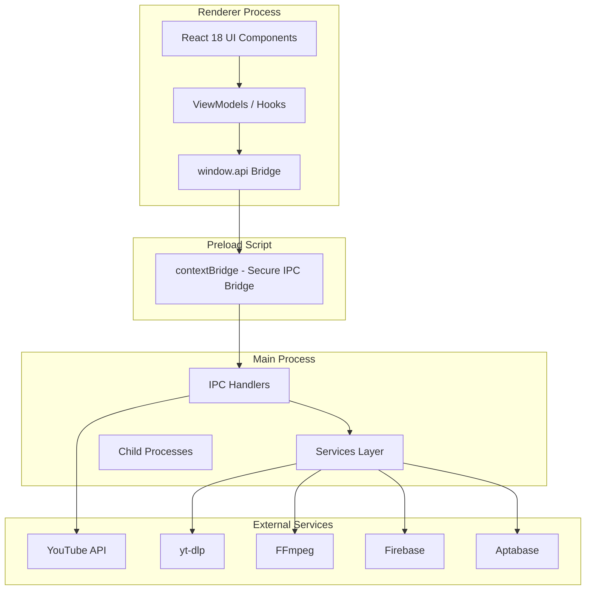

# PNUTDownloader Technical Documentation

**Electron.js Cross-Platform Video Downloader**

**Version:** 1.3.0  
**Date:** March 10, 2026  
**Maintained By:** Shoaib Akhter

---

## Document Version History

| Version | Date | Author | Change Summary |
|---------|------|--------|----------------|
| 1.0.0 | 10/03/2026 | Shoaib Akhter | Initial documentation — all features documented post-development |
| 1.x.x | [Date] | [Author] | [Describe change, e.g. Added Section X for Feature Y] |

> **📌 Documentation Maintenance**  
> Every time a feature is added, modified, or removed, update this document in the same PR/commit. Version should match the app's semantic version. Author = developer who made the change.

---

## Table of Contents

1. [Project Overview](#1-project-overview)
2. [Application Architecture](#2-application-architecture)
3. [Feature Documentation](#3-feature-documentation)
4. [Wireframes & Screen Reference](#4-wireframes--screen-reference)
5. [API Reference](#5-api-reference)
6. [Third-Party Library & Integration Reference](#6-third-party-library--integration-reference)
7. [Environment & Configuration](#7-environment--configuration)
8. [Non-Functional Requirements](#8-non-functional-requirements)
9. [Testing Strategy](#9-testing-strategy)
10. [Build & Deployment](#10-build--deployment)
11. [Known Issues & Technical Debt](#11-known-issues--technical-debt)
12. [Glossary](#12-glossary)
13. [Appendix](#appendix)

---
## 1. Project Overview

This section provides a high-level description of the application — what it does, who uses it, and how it is deployed.

### 1.1 Application Summary

PNUTDownloader is a cross-platform desktop video downloader built with Electron.js that supports 1700+ websites including YouTube, Instagram, TikTok, Facebook, Twitter/X, and more. The application is designed for end consumers who need to download videos from various platforms for offline viewing.

**Application Details:**

- **Application Name:** PNUTDownloader
- **Platform(s):** Desktop (Electron.js — Windows / macOS / Linux)
- **Primary Purpose:** Cross-platform desktop video downloader supporting 1700+ websites
- **Target Users:** End consumers who need to download videos from various platforms for offline viewing
- **Current Version:** 1.3.0
- **Repository URL:** https://github.com/Shoaib-Akh/pnutdownloader
- **CI/CD Pipeline:** GitHub Actions (electron-builder for releases)
- **Production URL / Store Link:** https://github.com/Shoaib-Akh/pnutdownloader/releases


### 1.2 Technology Stack

PNUTDownloader is built using modern web technologies packaged as a desktop application. The following table outlines the complete technology stack:

| Layer | Technology | Version | Purpose |
|-------|------------|---------|---------|
| **Desktop Frontend** | Electron.js | 34.x | Desktop wrapper (Windows/macOS/Linux) |
| **Frontend Framework** | React | 18.x | UI rendering and component management |
| **Build Tool** | Vite | 6.x | Bundling and compilation |
| **State Management** | React Hooks (useState, useEffect, useRef) | N/A | Local component state and side effects |
| **Styling** | React Bootstrap + Custom CSS | 5.x | UI components and styling |
| **Download Engine** | yt-dlp | Latest nightly | Core video downloading capability (1700+ sites) |
| **Media Processing** | FFmpeg | N/A | Video/audio transcoding and merging |
| **Authentication** | Firebase Auth / Cookies | N/A | User identity (optional), YouTube cookie auth |
| **Database** | Firebase Firestore + Realtime Database | N/A | Analytics, error tracking, download history |
| **Analytics** | Aptabase | 0.3.x | Usage analytics and event tracking |
| **Auto-Update** | electron-updater | 6.x | App automatic updates |
| **Build & Package** | electron-builder | 25.x | Cross-platform executable generation |
| **Testing** | Jest | 29.x | Unit and integration testing |
| **Code Quality** | ESLint + Prettier | 9.x / 3.x | Code linting and formatting |

> **📌 Template Instruction**  
> The table above reflects the actual technology stack used in the project. All versions are sourced from package.json and build configurations.


## 2. Application Architecture

This section defines how the system is structured — both at the macro (system) and micro (codebase) level. A developer joining the project should be able to read this section and understand how data flows end-to-end.

### 2.1 High-Level Architecture Diagram



The architecture shows a clear separation of concerns:
- **Renderer Process**: React 18 single-page application with viewmodels/hooks for business logic
- **Preload Script**: Secure contextBridge that exposes whitelisted IPC methods
- **Main Process**: Node.js process with service modules handling yt-dlp, FFmpeg, clipboard, updates
- **External Services**: YouTube Data API, yt-dlp binary, FFmpeg binary, Firebase, Aptabase


### 2.2 System Components

PNUTDownloader consists of several key components that work together to provide a seamless video downloading experience:

| Component | Type | Technology | Responsibility |
|-----------|------|------------|----------------|
| **Desktop App** | Frontend | Electron.js | User-facing desktop shell with same/shared UI layer |
| **UI Layer** | Frontend | React 18 | User interface rendering and state management |
| **Download Engine** | Service | yt-dlp | Video/audio downloading from 1700+ websites |
| **Media Processing** | Service | FFmpeg | Video transcoding, audio extraction, format conversion |
| **Cookie Management** | Service | Custom (cookies.txt) | YouTube authentication for age-restricted content |
| **Clipboard Monitor** | Service | Electron Clipboard API | Auto-detect copied video URLs |
| **Auto-Update** | Service | electron-updater | App and yt-dlp binary updates |
| **Analytics** | Service | Aptabase | Usage event tracking |
| **Data Persistence** | Storage | Firebase Firestore | Download history, analytics, error logs |
| **Local Storage** | Storage | localStorage | Download queue, settings, download count |


### 2.3 Project Folder Structure

The project follows a standard Electron application structure with clear separation of concerns:

```
/project-root
  /src
    /main                    — Electron main process
      index.js               — Main entry point, IPC handlers
      /services              — Service layer
        DownloadService.js   — yt-dlp child process management
        YtdlpService.js      — yt-dlp version check and updates
        FfmpegService.js     — FFmpeg version and processing
        CookieService.js     — YouTube cookie management
        PathService.js       — Path resolution (dev vs packaged)
        PlatformService.js   — OS-level utilities
        UpdateService.js     — electron-updater integration
        ClipboardService.js  — Clipboard URL detection

    /preload                 — Electron preload scripts
      index.js               — Secure contextBridge API

    /renderer                — React application
      /src
        /assets              — Static files, images, CSS
        /components          — Reusable UI components
          Navbar/            — Download settings bar
          Sidebar/           — Navigation sidebar
          BodySection/       — Main content area
          DownloadList/      — Download queue display
          Modals/            — Various modal dialogs
          ErrorBoundary/     — React error handling
        /viewmodels          — React hooks (business logic)
          useAppLifecycle.js — App initialization
          useDownloadManager.js — Download queue management
          useDownloadListVM.js  — Download list display
        /utils               — Utility functions
          firestoreService.js — Firebase operations
        App.jsx              — Root component

    /shared                  — Shared code (main + renderer)
      ipcChannels.js         — IPC channel constants
      platformUtils.js        — Platform detection utilities
      urlUtils.js             — URL parsing utilities
      errorHandler.js         — Error handling utilities

  /public                    — Static assets bundled in app
    yt-dlp.exe               — Windows yt-dlp binary
    yt-dlp_macos             — macOS yt-dlp binary
    ffmpeg                   — FFmpeg binary
    cookies.txt              — YouTube cookies
    all.json                 — Supported URL patterns
    formats.json             — Download format options

  /resources                 — App icons
    icon.png
    icon.icns
    icon.iconset/

  /docs                      — Documentation
    ARCHITECTURE.md          — Detailed architecture
    API_REFERENCE.md         — IPC and API reference
    USER_GUIDE.md           — End-user documentation

  /tests                     — Test suites
    *.test.js                — Jest unit tests

  package.json               — Dependencies and scripts
  electron-builder.yml       — Build configuration
  electron.vite.config.mjs   — Vite bundler config
  .env                       — Environment variables
```


### 2.4 Data Flow

The following describes how data moves through the application for a typical user action (video download):

| Step | Actor / Layer | Action | Output |
|------|---------------|--------|--------|
| 1 | User (UI) | Pastes URL or clicks download button | UI event fired |
| 2 | Component | Calls useDownloadManager.enqueueDownload() | Async call initiated |
| 3 | ViewModel | Validates URL, checks duplicates, detects platform | State updated with new download entry |
| 4 | Metadata Service | YouTube → YouTubeAPIManager → YouTube Data API v3<br>Other → NonYouTubeMetadataExtractor → yt-dlp --dump-json | Video metadata fetched |
| 5 | If playlist | PlaylistSelectionModal displayed | User selects videos |
| 6 | Download Queue | Added to localStorage with UUID | Download queued |
| 7 | Main Process | window.api.downloadVideo(params) via IPC | IPC call to main process |
| 8 | DownloadService | Spawns yt-dlp child process with args | Child process started |
| 9 | yt-dlp stdout | Progress streamed via IPC_EVENTS.DOWNLOAD_PROGRESS | Progress events sent |
| 10 | Renderer | Parses progress: %, speed, ETA, file size | UI progress bar updated |
| 11 | On completion | Status = "Completed"<br>saveDownload() → Firestore<br>bumpDownloadCount() → DonationModal (every 4th) | Download finished, analytics |


## 3. Feature Documentation

Each feature is documented in its own subsection. The goal is that any developer can read a feature section and understand what it does, where the code lives, how to extend it, and what to watch out for.

> **📌 Documentation Guidelines**  
> 1. Duplicate section 3.x for every distinct feature or module.  
> 2. Fill every sub-section — even if the answer is 'N/A'. Leaving blanks causes confusion.  
> 3. Link to the actual file paths in your repository where possible.  
> 4. Screenshots/wireframes go in Section 4 (Wireframes). Reference them here.


### 3.1 Video Downloading — Core Download Engine

#### 3.1.1 Overview

| Attribute | Detail |
|-----------|--------|
| **Feature Name** | Video Downloading |
| **Module / Domain** | Download Engine |
| **Platform** | Desktop (Electron.js) |
| **Status** | Completed |
| **Introduced in Version** | 1.0.0 |
| **Last Modified** | 10/03/2026 |
| **Owner / Author** | Shoaib Akhter |
| **Related Jira / Ticket** | N/A |

#### 3.1.2 Purpose & Business Context

PNUTDownloader's core feature enables users to download videos from 1700+ websites using yt-dlp as the download engine. Users can select quality, format, and bitrate options. The download queue processes items sequentially to prevent bandwidth issues. This feature is the primary value proposition of the application.


#### 3.1.3 User Stories / Acceptance Criteria

| As a... | I want to... | So that... |
|----------|-------------|------------|
| **User** | Paste a video URL | The video starts downloading |
| | | I can save the video for offline viewing |
| **User** | Select video quality (1080p, 720p, etc.) | The video downloads in selected quality |
| | | I can balance quality vs. file size |
| **User** | Select format (MP4, MKV, WEBM) | The video is saved in chosen format |
| | | I can ensure compatibility with my devices |
| **User** | Download audio only (MP3, M4A) | Extract audio from video |
| | | I can save storage space and listen offline |
| **User** | Queue multiple downloads | They process sequentially |
| | | I don't overwhelm my bandwidth |
| **User** | Pause/Resume a download | Stop and continue later |
| | | I can manage bandwidth usage |


#### 3.1.4 Screens / UI Components

| Screen / Component | Platform | File Path | Description |
|-------------------|----------|-----------|-------------|
| **Navbar** | Desktop | src/renderer/src/components/Navbar/index.jsx | Download settings bar with type, quality, format, bitrate, save location |
| **BodySection** | Desktop | src/renderer/src/components/BodySection/index.jsx | Main area for URL input, platform shortcuts, download list |
| **DownloadList** | Desktop | src/renderer/src/components/DownloadList/index.jsx | Active and completed downloads display with progress |
| **PlatformIcons** | Desktop | src/renderer/src/components/PlatformIcons/index.jsx | Quick-access buttons for supported platforms |
| **DownloadService** | Main Process | src/main/services/DownloadService.js | yt-dlp child process management |
| **YtdlpService** | Main Process | src/main/services/YtdlpService.js | yt-dlp version management and updates |
| **FfmpegService** | Main Process | src/main/services/FfmpegService.js | FFmpeg processing for format conversion |

> **📌 Wireframe Reference**  
> See Wireframe 4.1 (Section 4) for the login screen mockup. For implemented UI, add a screenshot to the /docs/screenshots folder and embed it here.


#### 3.1.5 State Management

| State Key / Slice | Store File Path | Shape (fields) | When Updated |
|------------------|----------------|----------------|--------------|
| **downloadList** | localStorage | Array of {id, url, title, status, progress, format, quality} | On add/remove/complete download |
| **activeDownloads** | useDownloadManager | Set of active download IDs | When download starts/finishes |
| **progressMap** | useDownloadManager | Map<downloadId, progress> | Every progress event from yt-dlp |
| **downloadQueue** | useDownloadManager | Array of pending downloads | When items added to queue |


#### 3.1.6 API / Service Layer

| Endpoint / Function | Method | File Path | Request Payload | Response Shape | Notes |
|-------------------|---------|-----------|----------------|----------------|-------|
| **downloadVideo** | IPC invoke | src/main/index.js | { id, url, isAudioOnly, selectedFormat, selectedQuality, selectBitrate, title, saveTo } | void (progress via event) | Progress streamed via IPC_EVENTS.DOWNLOAD_PROGRESS |
| **fetch-video-info** | IPC invoke | src/main/index.js | { url } | { title, thumbnail, duration, formats } | YouTube uses Data API, others use yt-dlp --dump-json |
| **fetch-playlist-entries** | IPC invoke | src/main/index.js | { url } | { title, videos: [] } | Returns all videos in playlist |
| **pauseDownload** | IPC invoke | src/main/index.js | { downloadId } | { success } | Kills child process |
| **resumeDownload** | IPC invoke | src/main/index.js | { downloadId } | { success } | Re-spawns yt-dlp process |


#### 3.1.7 Business Logic & Key Decisions

**Why this approach was chosen:**
yt-dlp was chosen because it supports 1700+ websites out of the box, has active development, and handles various video formats. Using child process spawning allows real-time progress streaming.

**Known gotchas, edge cases, and quirks:**
- Downloads are sequential (one at a time) to prevent bandwidth issues
- YouTube requires cookies for age-restricted content
- Some platforms may have rate limiting
- FFmpeg must be bundled for format conversion

**Trade-offs made:**
- Sequential processing was chosen over parallel to prioritize user bandwidth
- localStorage used over SQLite for simplicity (sufficient for queue data)

**Technical debt and planned refactoring:**
- Consider adding parallel download option with user toggle
- Could migrate from localStorage to IndexedDB for larger queues


#### 3.1.8 Third-Party Libraries Used

| Library | Version | Purpose | Docs URL |
|---------|---------|---------|----------|
| **yt-dlp** | Latest nightly | Video downloading from 1700+ sites | https://github.com/yt-dlp/yt-dlp |
| **FFmpeg** | N/A | Video transcoding and audio extraction | https://ffmpeg.org/ |
| **tree-kill** | 1.2.x | Kill child processes on pause | https://www.npmjs.com/package/tree-kill |
| **tar** | 7.x | Extract yt-dlp from nightly archives | https://www.npmjs.com/package/tar |


#### 3.1.9 Platform-Specific Notes

| Platform | Specific Behavior / Config |
|----------|------------------------|
| **Windows** | yt-dlp.exe in resources, ffmpeg.exe bundled |
| **macOS** | yt-dlp_macos with chmod 755 permissions required |
| **Linux** | yt-dlp (no extension), ffmpeg via system or bundled |
| **Electron (Windows)** | safeStorage uses DPAPI for credential encryption |
| **Electron (macOS)** | Uses Keychain for credential storage (if added) |


#### 3.1.10 Error Handling

| Scenario | Error Code / Type | Handling Strategy | User-Facing Message |
|----------|------------------|------------------|-------------------|
| **Download failed** | yt-dlp exit code != 0 | Log to Firestore, show retry option | "Download failed. Please try again." |
| **No internet** | Network Error | Show retry option | "No internet connection. Please try again." |
| **Invalid URL** | URL validation fail | Show inline error | "Please enter a valid video URL." |
| **Rate limited** | 429 from YouTube | Auto-retry with backoff | "Rate limited. Retrying..." |
| **Age-restricted** | YouTube error | Prompt for cookie login | "This video requires age verification. Please add cookies." |


#### 3.1.11 Testing

| Test Type | Tool | File Path | Coverage Summary |
|-----------|------|----------|----------------|
| **Unit — platform detection** | Jest | tests/platformUtils.test.js | detectPlatform, extractVideoId functions |
| **Unit — URL utilities** | Jest | tests/urlUtils.test.js | URL parsing and validation |
| **Platform service** | Jest | tests/PlatformService.test.js | OS detection, path resolution |
| **Integration — IPC** | Manual | N/A | IPC handlers respond correctly |
| **E2E — Download flow** | Manual | N/A | Full download path tested |


#### 3.1.12 How to Extend This Feature

**Step-by-step guide for a developer adding a new capability to this feature:**

1. Add the new format/quality option in `public/formats.json`
2. If new download options needed, update `DownloadService.js` spawn logic
3. Add corresponding UI option in Navbar component
4. Test with known video URLs on each platform
5. Update `formats.json` documentation in `USER_GUIDE.md`


3.2 Playlist Support — Multi-Video Downloads


3.2.1 Overview

Attribute

Detail

Feature Name

Playlist Support

Module / Domain

Download Engine

Platform

Desktop (Electron.js)

Status

Completed

Introduced in Version

1.0.0

Last Modified

10/03/2026

Owner / Author

Shoaib Akhter

Related Jira / Ticket

N/A


3.2.2 Purpose & Business Context

Users often want to download entire playlists or multiple videos at once. This feature allows fetching playlist metadata, displaying a selection modal where users can choose which videos to download, and queuing multiple items together.


3.2.3 User Stories / Acceptance Criteria

As a...

I want to...

So that...

User

Paste a playlist URL

See all videos in the playlist

I can choose which ones to download

User

Select multiple videos

Download only selected videos

I don't download unwanted content

User

Select all / Deselect all

Quickly toggle selection

I can efficiently manage large playlists


3.2.4 Screens / UI Components

Screen / Component

Platform

File Path

Description

PlaylistSelectionModal

Desktop

src/renderer/src/components/PlaylistSelectionModal/index.jsx

Modal showing playlist videos with checkboxes

useDownloadManager

Desktop

src/renderer/src/viewmodels/useDownloadManager.js

Playlist detection and queue management


3.2.5 State Management

State Key / Slice

Store File Path

Shape (fields)

When Updated

playlistVideos

useDownloadManager

Array of {id, title, thumbnail, selected}

When playlist URL detected and fetched

isPlaylistModalOpen

PlaylistSelectionModal

boolean

When playlist detected, before enqueue


3.2.6 API / Service Layer

Endpoint / Function

Method

File Path

Request Payload

Response Shape

Notes

fetch-playlist-entries

IPC invoke

src/main/index.js

{ url }

{ title, entries: [{id, title, thumbnail}] }

Uses yt-dlp --flat-playlist or --dump-json


3.2.7 Business Logic & Key Decisions

Why was this approach chosen over alternatives?

Modal selection was chosen to give users full control over which videos to download. This prevents accidental large downloads and improves UX.

Are there any known gotchas, edge cases, or quirks?

- Very large playlists (1000+ videos) may be slow to load
- Playlist URL detection requires specific path patterns

What were the trade-offs made?

- Chose modal over inline list for cleaner UI
- Sequential processing of playlist items to manage resources


3.2.8 Third-Party Libraries Used

Library

Version

Purpose

Docs URL

yt-dlp

Latest nightly

Playlist extraction

https://github.com/yt-dlp/yt-dlp


3.2.9 Platform-Specific Notes

Platform

Specific Behavior / Config

All platforms

Same behavior across Windows/macOS/Linux

YouTube

Uses YouTube Data API when available for faster metadata

Other platforms

Uses yt-dlp --dump-json fallback


3.2.10 Error Handling

Scenario

Error Code / Type

Handling Strategy

User-Facing Message

Playlist not found

yt-dlp error

Show error toast

"Could not fetch playlist. Please check the URL."

Private playlist

YouTube error

Prompt for cookies

"This playlist is private. Please add cookies."


3.2.11 Testing

Test Type

Tool

File Path

Coverage Summary

Unit — playlist URL detection

Jest

N/A

extractPlaylistId function

Integration

Manual

N/A

Full playlist flow tested


3.2.12 How to Extend This Feature

Step-by-step guide for a developer adding new capability:


Add new field in playlist entry (e.g., duration) in fetch handler

Update PlaylistSelectionModal to display new field

Add filtering/sorting options to modal

Test with various playlist sizes (small, medium, large)


3.3 Clipboard URL Detection — Auto-Download Prompt


3.3.1 Overview

Attribute

Detail

Feature Name

Clipboard URL Detection

Module / Domain

System Integration

Platform

Desktop (Electron.js)

Status

Completed

Introduced in Version

1.1.0

Last Modified

10/03/2026

Owner / Author

Shoaib Akhter

Related Jira / Ticket

N/A


3.3.2 Purpose & Business Context

When users copy a video URL from their browser, PNUTDownloader detects it and shows a modal asking if they want to download the video. This provides a seamless workflow where users don't need to manually paste URLs into the app.


3.3.3 User Stories / Acceptance Criteria

As a...

I want to...

So that...

User

Copy a video URL anywhere on my computer

Get a prompt to download it

I can quickly start downloading without switching apps

User

Dismiss the prompt

Not be bothered again for that URL

I can maintain my workflow

User

Enable/disable detection

Control when detection happens

I can manage my privacy preferences


3.3.4 Screens / UI Components

Screen / Component

Platform

File Path

Description

ClipboardService

Main Process

src/main/services/ClipboardService.js

Clipboard polling and URL detection

UrlDetectionModal

Desktop

src/renderer/src/components/UrlDetectionModal/index.jsx

Modal prompting user when URL detected

useAppLifecycle

Desktop

src/renderer/src/viewmodels/useAppLifecycle.js

Clipboard detection initialization


3.3.5 State Management

State Key / Slice

Store File Path

Shape (fields)

When Updated

clipboardMonitorInterval

ClipboardService

setInterval ID

Every 2 seconds when app active

lastClipboardText

ClipboardService

string

On each clipboard read

urlDetectionModalOpen

UrlDetectionModal

boolean

When downloadable URL detected

detectedUrl

UrlDetectionModal

string

When URL matches patterns in all.json


3.3.6 API / Service Layer

Endpoint / Function

Method

File Path

Request Payload

Response Shape

Notes

video-url-detected

IPC Event

src/main/index.js

N/A (pushed)

{ url }

Sent when clipboard URL matches pattern

get-youtube-info

IPC invoke

src/main/index.js

{ url }

Video metadata

Validates URL and gets preview info


3.3.7 Business Logic & Key Decisions

Why was this approach chosen over alternatives?

Polling clipboard every 2 seconds was chosen as it's reliable across all platforms. Alternatives like native clipboard events are not available in Electron.

Are there any known gotchas, edge cases, or quirks?

- Only detects URLs matching patterns in public/all.json
- Duplicate URLs within 5 seconds are ignored to prevent spam
- App must be running (can be minimized)

What were the trade-offs made?

- Polling was chosen over native events (not available in Electron)
- 2-second interval balances responsiveness vs. resource usage

Is there any technical debt or planned refactoring?

- Consider adding toggle in Settings to disable detection
- Could optimize to detect only when app is in foreground


3.3.8 Third-Party Libraries Used

Library

Version

Purpose

Docs URL

Electron clipboard

Built-in

Read system clipboard

https://www.electronjs.org/docs/latest/api/clipboard


3.3.9 Platform-Specific Notes

Platform

Specific Behavior / Config

All platforms

Same clipboard polling behavior

Windows

Uses Win32 clipboard API via Electron

macOS

Uses NSPasteboard via Electron

Linux

Uses X11 clipboard via Electron


3.3.10 Error Handling

Scenario

Error Code / Type

Handling Strategy

User-Facing Message

Invalid URL format

Pattern mismatch

Ignore (no modal shown)

N/A - silent

URL leads to error

yt-dlp error

Show error in modal after download attempt

"Could not download this video"


3.3.11 Testing

Test Type

Tool

File Path

Coverage Summary

Unit — URL pattern matching

Manual

public/all.json

Various URL formats tested

Integration — clipboard

Manual

N/A

Copy/paste flow tested on each OS


3.3.12 How to Extend This Feature

Step-by-step guide for a developer adding new capability:


Add new URL pattern to public/all.json

Add corresponding platform in src/shared/platformUtils.js

Test with actual URLs from the new platform

Update USER_GUIDE.md with new supported sites


3.4 Auto-Update — App and yt-dlp Updates


3.4.1 Overview

Attribute

Detail

Feature Name

Auto-Update

Module / Domain

System Integration

Platform

Desktop (Electron.js)

Status

Completed

Introduced in Version

1.0.0

Last Modified

10/03/2026

Owner / Author

Shoaib Akhter

Related Jira / Ticket

N/A


3.4.2 Purpose & Business Context

PNUTDownloader automatically updates both the app itself and the yt-dlp binary. App updates come from GitHub releases. yt-dlp updates check for new nightly builds every 3 days. This ensures users always have the latest features and maximum site compatibility.


3.4.3 User Stories / Acceptance Criteria

As a...

I want to...

So that...

User

Launch the app

Get latest version automatically

I always have the newest features

User

Get notified of updates

See what's new and install when ready

I can decide when to update

User

Be able to force update yt-dlp

Manually trigger yt-dlp update

I can get latest site support immediately

User

Update in background

Continue using the app

I don't lose productivity during update


3.4.4 Screens / UI Components

Screen / Component

Platform

File Path

Description

UpdateNotification

Desktop

src/renderer/src/components/UpdateNotification/index.jsx

Banner showing update available/installed

UpdateService

Main Process

src/main/services/UpdateService.js

electron-updater integration

YtdlpService

Main Process

src/main/services/YtdlpService.js

yt-dlp binary version management

useAppLifecycle

Desktop

src/renderer/src/viewmodels/useAppLifecycle.js

Update check on startup


3.4.5 State Management

State Key / Slice

Store File Path

Shape (fields)

When Updated

updateAvailable

useAppLifecycle

boolean

When new version found

updateInfo

useAppLifecycle

{ version, releaseNotes }

When update metadata received

updateDownloaded

useAppLifecycle

boolean

When download complete, ready to install

ytdlpVersion

YtdlpService

string

When version check completes


3.4.6 API / Service Layer

Endpoint / Function

Method

File Path

Request Payload

Response Shape

Notes

check-ytdlp-update

IPC invoke

src/main/index.js

N/A

{ current, latest, needsUpdate }

Checks GitHub for latest nightly

update-ytdlp

IPC invoke

src/main/index.js

N/A

{ success, version }

Downloads and replaces binary

download-update

IPC invoke

src/main/index.js

N/A

void

Downloads app update

install-update

IPC invoke

src/main/index.js

N/A

void

Quits and installs update

check-for-updates

IPC Event

src/main/index.js

N/A

{ version, releaseNotes }

Pushed when update available


3.4.7 Business Logic & Key Decisions

Why was this approach chosen over alternatives?

GitHub releases chosen as provider for electron-updater due to existing repo infrastructure. yt-dlp uses nightly builds from GitHub API.

Are there any known gotchas, edge cases, or quirks?

- App updates require restart to apply
- yt-dlp update happens silently in background
- Network errors during update are logged but don't crash app

What were the trade-offs made?

- Chose 3-day interval for yt-dlp to balance freshness vs. bandwidth
- App updates are opt-in (user must click Install)

Is there any technical debt or planned refactoring?

- Could add auto-install option for app updates
- Could add update channel selection (stable/beta)


3.4.8 Third-Party Libraries Used

Library

Version

Purpose

Docs URL

electron-updater

6.x

App auto-update from GitHub releases

https://www.electronjs.org/docs/latest/api/auto-updater

https

Built-in

Download yt-dlp binaries

N/A


3.4.9 Platform-Specific Notes

Platform

Specific Behavior / Config

Windows

Uses electron-builder NSIS installer

macOS

Uses DMG with auto-updater

Linux

Uses AppImage, update on next launch


3.4.10 Error Handling

Scenario

Error Code / Type

Handling Strategy

User-Facing Message

Update download fails

Network error

Retry silently, log to console

N/A - silent

GitHub API rate limit

429

Log warning, skip this check

N/A - silent

Invalid release asset

Parse error

Log error, continue with current version

N/A - silent


3.4.11 Testing

Test Type

Tool

File Path

Coverage Summary

Unit — version parsing

Manual

src/main/services/YtdlpService.js

Version string parsing

Integration — update flow

Manual

N/A

Full update tested on each OS


3.4.12 How to Extend This Feature

Step-by-step guide for a developer adding new capability:


Add new check logic in UpdateService or YtdlpService

Add UI toggle in Settings if needed

Test with mock GitHub API responses

Verify update works on all target platforms


3.5 Built-in Browser — WebView Integration


3.5.1 Overview

Attribute

Detail

Feature Name

Built-in Browser

Module / Domain

User Interface

Platform

Desktop (Electron.js)

Status

Completed

Introduced in Version

1.2.0

Last Modified

10/03/2026

Owner / Author

Shoaib Akhter

Related Jira / Ticket

N/A


3.5.2 Purpose & Business Context

Users can browse websites directly within PNUTDownloader using an embedded Chromium WebView. They can navigate to videos and click a download button that appears on supported platforms for seamless one-click downloading.


3.5.3 User Stories / Acceptance Criteria

As a...

I want to...

So that...

User

Browse within the app

Find videos without leaving

I have a unified experience

User

Click download on a video

Start downloading immediately

I don't need to copy/paste URLs

User

Login to YouTube

Access my subscriptions/history

I can download private content


3.5.4 Screens / UI Components

Screen / Component

Platform

File Path

Description

BodySection

Desktop

src/renderer/src/components/BodySection/index.jsx

Contains WebView component

WebView

Electron

<webview> tag

Embedded Chromium browser

PlatformIcons

Desktop

src/renderer/src/components/PlatformIcons/index.jsx

Quick navigation to popular sites


3.5.5 State Management

State Key / Slice

Store File Path

Shape (fields)

When Updated

showWebView

App.jsx

boolean

When user toggles browser view

webviewUrl

BodySection

string

When user navigates

cookiePartition

Preload

persist:main

Session cookie persistence

N/A - Electron internal


3.5.6 API / Service Layer

Endpoint / Function

Method

File Path

Request Payload

Response Shape

Notes

save-webview-cookies

IPC invoke

src/main/index.js

N/A

void

Saves WebView cookies to file

open-webview

IPC invoke

src/main/index.js

N/A

void

Opens WebView to URL

webview-url-update

IPC Event

src/main/index.js

N/A

{ url }

Sent on navigation


3.5.7 Business Logic & Key Decisions

Why was this approach chosen over alternatives?

Electron WebView chosen for seamless integration and cookie sharing with yt-dlp. Allows users to stay in-app while browsing.

Are there any known gotchas, edge cases, or quirks?

- WebView uses separate partition for cookies
- Must explicitly save cookies to file for yt-dlp use
- Some sites may block WebView User-Agent

What were the trade-offs made?

- Chose WebView over external browser for better UX
- Separate cookie storage for security isolation


3.5.8 Third-Party Libraries Used

Library

Version

Purpose

Docs URL

Electron WebView

Built-in

Embedded browser

https://www.electronjs.org/docs/latest/api/webview-tag


3.5.9 Platform-Specific Notes

Platform

Specific Behavior / Config

Windows

Uses Edge Chromium

macOS

Uses system Chromium

Linux

Uses system Chromium

Electron (All)

webview tag requires webSecurity: true


3.5.10 Error Handling

Scenario

Error Code / Type

Handling Strategy

User-Facing Message

WebView fails to load

Load failure

Show error state, offer retry

"Could not load page. Please try again."

Cookie save fails

File system error

Log error, notify user

"Could not save login. Download may fail."


3.5.11 Testing

Test Type

Tool

File Path

Coverage Summary

Integration — navigation

Manual

N/A

Various sites tested

Integration — cookies

Manual

N/A

YouTube login flow tested


3.5.12 How to Extend This Feature

Step-by-step guide for a developer adding new capability:


Add new platform button in PlatformIcons

Test download from new platform via WebView

Verify cookies work for the new platform


3.6 Analytics & Error Tracking — Firebase and Aptabase


3.6.1 Overview

Attribute

Detail

Feature Name

Analytics & Error Tracking

Module / Domain

Observability

Platform

Desktop (Electron.js)

Status

Completed

Introduced in Version

1.3.0

Last Modified

10/03/2026

Owner / Author

Shoaib Akhter

Related Jira / Ticket

N/A


3.6.2 Purpose & Business Context

PNUTDownloader tracks usage events and errors to understand how users interact with the app and to diagnose issues. This data helps prioritize feature development and debug problems reported by users. All tracking is anonymous and complies with privacy best practices.


3.6.3 User Stories / Acceptance Criteria

As a...

I want to...

So that...

Developer

See download success rate

Understand app reliability

I can prioritize fixes

Developer

Track feature usage

Make data-driven decisions

I know what to build next

Developer

See error details

Debug user issues faster

I can fix problems quickly


3.6.4 Screens / UI Components

Screen / Component

Platform

File Path

Description

firestoreService

Desktop

src/renderer/src/utils/firestoreService.js

Firebase Firestore operations

userTracking

Desktop

src/renderer/src/utils/userTracking.js

Device ID and tracking utilities

Aptabase integration

Main Process

src/main/index.js

Event tracking initialization


3.6.5 State Management

State Key / Slice

Store File Path

Shape (fields)

When Updated

deviceId

userTracking.js

string (UUID)

On first app launch

isOnline

firestoreService

boolean

On network status change

syncInProgress

firestoreService

boolean

During Firestore sync


3.6.6 API / Service Layer

Endpoint / Function

Method

File Path

Request Payload

Response Shape

Notes

saveDownload

Firestore

src/renderer/src/utils/firestoreService.js

Download record

Document ID

Creates document on completion

saveDownloadError

Firestore

src/renderer/src/utils/firestoreService.js

Error record

Document ID

Creates document on failure

trackEvent

Aptabase

src/main/index.js

Event name + properties

void

Sends to Aptabase


3.6.7 Business Logic & Key Decisions

Why was this approach chosen over alternatives?

Firebase chosen for its free tier and easy integration. Firestore for structured data, Realtime DB for existing data. Aptabase for lightweight event tracking.

Are there any known gotchas, edge cases, or quirks?

- Offline data is queued and synced when online
- Device ID generated once and stored locally
- No PII is collected (email, IP, etc.)

What were the trade-offs made?

- Chose Firebase for free tier availability
- Added offline queue for unreliable connections

Is there any technical debt or planned refactoring?

- Could add more granular event tracking
- Could add user consent toggle


3.6.8 Third-Party Libraries Used

Library

Version

Purpose

Docs URL

Firebase

12.x

Firestore database

https://firebase.google.com/docs/firestore

Aptabase

0.3.x

Analytics tracking

https://aptabase.com/docs

uuid

11.x

Generate device IDs

https://www.npmjs.com/package/uuid


3.6.9 Platform-Specific Notes

Platform

Specific Behavior / Config

All platforms

Same tracking behavior

Electron

Aptabase electron SDK

Tracks app_started event


3.6.10 Error Handling

Scenario

Error Code / Type

Handling Strategy

User-Facing Message

Firestore write fails

Network error

Queue locally, retry on reconnect

N/A - silent

Aptabase fails

Network error

Log to console, continue

N/A - silent


3.6.11 Testing

Test Type

Tool

File Path

Coverage Summary

Unit — device ID

Manual

src/renderer/src/utils/userTracking.js

UUID generation

Integration

Manual

N/A

Events appear in dashboard


3.6.12 How to Extend This Feature

Step-by-step guide for a developer adding new tracking:


Add trackEvent call in appropriate location

Define event name and properties

Verify in Aptabase dashboard

Ensure no PII is included


4. Wireframes & Screen Reference

This section is a visual index of all application screens. Each screen should be represented with a wireframe or screenshot, a description, and links to the corresponding feature section.


📌  INSTRUCTION

For each screen: insert a screenshot or wireframe image, fill the table, and reference the feature section.

Name each figure consistently: Figure 1 = Screen 1, Figure 2 = Screen 2, etc.

Store screenshot files in: /docs/screenshots/[screen-name].png


4.1 Main Application Window

[ Refer to existing documentation in docs/USER_GUIDE.md for UI screenshots ]


Attribute

Detail

Screen Name

Main Window

Route / Path

/ (root)

Platform

Desktop

Feature Reference

Sections 3.1, 3.2, 3.5

Entry Points

App launch, Sidebar navigation

Exit Points

Close app, Minimize to tray

Key UI Elements

Navbar, Sidebar, BodySection, DownloadList, PlatformIcons

Validation

N/A - not a form

Loading State

Initializing Dependencies spinner on first launch

Error State

ErrorBoundary catches React errors


4.2 Download Settings (Navbar)

[ Refer to docs/USER_GUIDE.md ]


Attribute

Detail

Screen Name

Navbar - Download Settings

Route / Path

/ (always visible)

Platform

Desktop

Feature Reference

Section 3.1 - Video Downloading

Entry Points

App launch

Exit Points

Settings persisted to localStorage

Key UI Elements

Type dropdown (Video/Audio), Quality dropdown, Format dropdown, Bitrate dropdown, Save Location picker

Validation

Validates selected options before download

Loading State

N/A

Error State

N/A


4.3 Download List

[ Refer to docs/USER_GUIDE.md ]


Attribute

Detail

Screen Name

Download List

Route / Path

/ (shown when Downloads selected in sidebar)

Platform

Desktop

Feature Reference

Section 3.1 - Video Downloading

Entry Points

Sidebar > All Files

Exit Points

Close file, Delete file

Key UI Elements

Progress bars, Status badges, Action buttons (pause/resume/delete/open)

Validation

N/A

Loading State

Skeleton loaders while fetching

Error State

Retry button on failed downloads


4.4 URL Detection Modal

[ Refer to docs/USER_GUIDE.md ]


Attribute

Detail

Screen Name

URL Detection Modal

Route / Path

Modal overlay

Platform

Desktop

Feature Reference

Section 3.3 - Clipboard Detection

Entry Points

Clipboard URL detected

Exit Points

Dismiss, Download, Close

Key UI Elements

URL display, Video thumbnail, Download button, Dismiss button

Validation

URL validated against all.json patterns

Loading State

Fetching video info

Error State

Error message if fetch fails


4.5 Playlist Selection Modal

[ Refer to docs/USER_GUIDE.md ]


Attribute

Detail

Screen Name

Playlist Selection Modal

Route / Path

Modal overlay

Platform

Desktop

Feature Reference

Section 3.2 - Playlist Support

Entry Points

Playlist URL enqueued

Exit Points

Cancel, Download Selected

Key UI Elements

Playlist title, Video list with checkboxes, Select All/None buttons

Validation

At least one video selected

Loading State

Loading videos from playlist

Error State

Error if playlist fetch fails


4.6 Update Notification Banner

[ Refer to docs/USER_GUIDE.md ]


Attribute

Detail

Screen Name

Update Notification

Route / Path

Top banner

Platform

Desktop

Feature Reference

Section 3.4 - Auto-Update

Entry Points

Update available from GitHub

Exit Points

Install (when downloaded), Dismiss (when available)

Key UI Elements

Update version, Install button, Dismiss button

Loading State

Download progress shown

Error State

Error message if download fails


5. API Reference

A consolidated reference of all backend API endpoints consumed by this application. For detailed request/response schemas, link to your Swagger/OpenAPI spec or Postman collection.


📌  LINK TO API SPEC

For detailed IPC channel definitions, see: docs/API_REFERENCE.md

This section serves as a quick index. The spec is the source of truth for full request/response schemas.


5.1 Base Configuration

Environment

Base URL

Auth Method

Development

http://localhost:[PORT]/api/v1

N/A - local only

Staging

N/A

N/A

Production

N/A

N/A

Note: This is a desktop application. It does not consume traditional REST APIs. Instead, it uses:
- YouTube Data API v3 for YouTube metadata
- yt-dlp for video downloading
- Firebase Firestore for analytics
- GitHub API for updates


5.2 IPC Channel Index

Module

Method

Endpoint

Auth Required

Section Reference

Download

POST

downloadVideo

No

3.1

Download

POST

pauseDownload

No

3.1

Download

POST

resumeDownload

No

3.1

Metadata

GET

fetch-video-info

No

3.1

Metadata

GET

fetch-playlist-entries

No

3.2

System

GET

check-dependencies

No

3.4

System

POST

update-ytdlp

No

3.4

System

GET

check-ytdlp-update

No

3.4

System

POST

install-update

No

3.4

Storage

POST

select-folder

No

3.1

Cookies

GET

get-youtube-cookies

No

3.1

Events

N/A

download-progress

No

3.1

Events

N/A

update-available

No

3.4

Events

N/A

video-url-detected

No

3.3


5.3 YouTube Data API

Endpoint

Method

Auth

Purpose

https://www.googleapis.com/youtube/v3/videos

GET

API Key

Get video metadata

https://www.googleapis.com/youtube/v3/playlists

GET

API Key

Get playlist metadata

https://www.googleapis.com/youtube/v3/playlistItems

GET

API Key

Get playlist videos

Note: Multiple API keys are rotated for quota management (see .env).


6. Third-Party Library & Integration Reference

A complete index of all external dependencies. Helps evaluate upgrade impact, security vulnerabilities, and licensing.


Library / Service

Category

Version

Platform

Purpose

Config File / Notes

electron

Core

34.x

Desktop

Desktop app shell

package.json

react

UI Framework

18.x

Desktop

React UI library

package.json

vite

Build Tool

6.x

Desktop

Bundling and dev server

electron.vite.config.mjs

electron-builder

Build Tool

25.x

Desktop

Package app for distribution

electron-builder.yml

electron-updater

Auto-Update

6.x

Desktop

App updates from GitHub

src/main/services/UpdateService.js

electron-dl

Download

4.x

Desktop

File download helper

src/main/index.js

@electron-toolkit/utils

Electron Utils

4.x

Desktop

Electron utilities

src/main/index.js

@electron-toolkit/preload

Electron Utils

3.x

Desktop

Preload helpers

src/preload/index.js

react-bootstrap

UI Library

2.x

Desktop

Bootstrap React components

src/renderer/src/components/*

bootstrap

Styling

5.x

Desktop

CSS framework

src/renderer/src/main.jsx

react-icons

Icons

5.x

Desktop

Icon library

src/renderer/src/components/*

react-loading-skeleton

UI Component

3.x

Desktop

Loading placeholders

src/renderer/src/components/*

firebase

Backend

12.x

Desktop

Firestore database

src/renderer/src/firebase.js

@aptabase/electron

Analytics

0.x

Desktop

Usage tracking

src/main/index.js

uuid

Utilities

11.x

Desktop

Device ID generation

src/renderer/src/utils/userTracking.js

tree-kill

Process

1.x

Desktop

Kill child processes

src/main/index.js

tar

Archive

7.x

Desktop

Extract yt-dlp archives

src/main/index.js

yt-dlp

Download Engine

Latest

Desktop

Video downloading

public/ (bundled binary)

FFmpeg

Media Processing

N/A

Desktop

Video transcoding

public/ (bundled binary)

Jest

Testing

29.x

Desktop

Unit testing

package.json

ESLint

Code Quality

9.x

Desktop

Linting

eslint.config.mjs

Prettier

Code Quality

3.x

Desktop

Formatting

.prettierrc.yaml


7. Environment & Configuration


7.1 Environment Variables

All environment variables must be defined in .env (not committed) based on .env.example (committed). Never hardcode secrets.


Variable Name

Required

Platform

Description

Example Value

VITE_YOUTUBE_API_KEY1

Yes

Desktop

YouTube Data API v3 key #1

AIzaSy...

VITE_YOUTUBE_API_KEY2

Yes

Desktop

YouTube Data API v3 key #2

AIzaSy...

VITE_YOUTUBE_API_KEY3

Yes

Desktop

YouTube Data API v3 key #3

AIzaSy...

VITE_YOUTUBE_API_KEY4

Yes

Desktop

YouTube Data API v3 key #4

AIzaSy...

VITE_YOUTUBE_API_KEY5

Yes

Desktop

YouTube Data API v3 key #5

AIzaSy...

GH_TOKEN

Yes (for releases)

Desktop

GitHub personal access token

github_pat_...

VITE_OPENAI_API_KEY

No

Desktop

OpenAI API key (future features)

sk-proj-...

OPENAI_API_KEY

No

Desktop

OpenAI API key (main process)

sk-proj-...


7.2 Feature Flags

Flag Name

Default

Purpose

Controlled By

ENABLE_CLIPBOARD_DETECTION

true

Auto-detect copied URLs

Hardcoded (can be toggled in code)

ENABLE_ANALYTICS

true

Track usage events

Hardcoded (can be toggled in code)

ENABLE_AUTO_UPDATE

true

Automatically update app

Hardcoded (can be toggled in code)


8. Non-Functional Requirements

NFR Category

Requirement

Measurement / Target

Status

Performance

App cold start < 5 seconds

Measured on mid-range machine

Met

Performance

Download start < 3 seconds after click

Network dependent

Met

Performance

UI responsive during download

No frame drops during progress updates

Met

Availability

App starts without network

Core features work offline

Met

Security

No secrets in source code

Manual code review

Met

Security

Context isolation enabled

Electron security defaults

Met

Security

nodeIntegration disabled

Electron security defaults

Met

Platform Support

Windows 10+

CI test matrix

Met

Platform Support

macOS 11+

CI test matrix

Met

Platform Support

Linux (Ubuntu 20.04+)

CI test matrix

Met

Browser/OS

Electron: Chromium 112+

Electron version constraint

Met


9. Testing Strategy

Test Level

Tool

Scope

Run Command

CI Triggered

Unit Tests

Jest

Platform utilities, URL parsing, reducers

npm test

On every PR

Component Tests

Manual

React component rendering

N/A

Manual

On PR review

Integration Tests

Manual

IPC handlers, services

N/A

Manual

On PR review

E2E — Desktop

Manual

Full user flows

N/A

Manual

Before release


9.1 Coverage Requirements

Layer

Minimum Coverage Target

Business logic (utils, services)

≥ 60%

State management (hooks)

≥ 70%

UI components (critical paths)

≥ 50%

Note: As a small project, full automated test coverage is not required. Manual testing covers critical user flows.


10. Build & Deployment

Step

Command / Action

Notes

Install deps

npm install

Use exact versions from lockfile

Env setup

Ensure .env exists

Never commit .env

Run desktop (dev)

npm run dev

Starts Electron with hot reload

Build desktop (prod)

npm run electron:build

Outputs to /dist per target OS

Build Windows

npm run build:win

Creates .exe installer

Build macOS

npm run build:mac

Creates .dmg installer

Build Linux

npm run build:linux

Creates AppImage

Publish release

npm run publish:release

Uploads to GitHub releases


10.1 CI/CD Pipeline Overview

The project uses GitHub Actions for CI/CD:

1. **Trigger**: Push to main or pull request
2. **Stages**:
   - Lint: ESLint + Prettier checks
   - Test: Jest unit tests
   - Build: electron-builder creates executables
3. **Deployment**: 
   - On tagged release, electron-builder uploads to GitHub Releases
   - Uses GitHub Releases as the update provider for electron-updater

Rollback procedure: Revert the commit and create a new release with higher version number.


## 11. Known Issues & Technical Debt

| ID | Issue / Debt Description | Severity | Affected Area | Workaround | Ticket |
|----|------------------------|----------|---------------|-----------|--------|
| **TD-001** | yt-dlp may fail on some new sites until next update | Low | Download Engine | Manually trigger update | N/A |
| **TD-002** | Large playlists (500+) may be slow to load | Medium | Playlist feature | Download in batches | N/A |
| **TD-003** | No way to disable clipboard detection | Low | Clipboard feature | Close app when not needed | N/A |
| **TD-004** | Download queue is sequential only | Medium | Download feature | None - by design | N/A |
| **TD-005** | Cookie login requires manual file management | Medium | Authentication | Follow user guide steps | N/A |


## 12. Glossary

| Term | Definition |
|------|------------|
| **Electron** | Framework for building cross-platform desktop apps using web technologies (HTML, CSS, JS) |
| **yt-dlp** | Open-source video downloader supporting 1700+ websites |
| **FFmpeg** | Cross-platform solution for recording, converting and streaming audio and video |
| **IPC** | Inter-Process Communication - how renderer and main process communicate in Electron |
| **Context Bridge** | Electron API that exposes safe APIs from main process to renderer |
| **Child Process** | Node.js module for spawning child processes (used for yt-dlp) |
| **WebView** | Embedded browser component in Electron |
| **electron-updater** | Module for automatic updates in Electron apps |
| **electron-builder** | Tool for packaging Electron apps for distribution |
| **Firestore** | NoSQL document database by Firebase |
| **Aptabase** | Privacy-focused analytics for desktop apps |
| **Vite** | Next-generation frontend build tool |
| **React** | JavaScript library for building user interfaces |
| **Chromium** | Open-source browser project that Electron is based on |


## Appendix

### A. Useful Links

| Resource | URL |
|----------|------|
| **Repository** | https://github.com/Shoaib-Akh/pnutdownloader |
| **Project Board (Jira)** | N/A - no Jira |
| **API Documentation (IPC)** | docs/API_REFERENCE.md |
| **Architecture Documentation** | docs/ARCHITECTURE.md |
| **User Guide** | docs/USER_GUIDE.md |
| **CI/CD Dashboard** | N/A - GitHub Actions |
| **Staging Environment** | N/A |
| **Error Monitoring** | N/A - using Firestore for errors |
| **Analytics Dashboard** | https://aptabase.com |

### B. Team & Contacts

| Role | Name | Contact |
|-------|------|----------|
| **Tech Lead / Architect** | Shoaib Akhter | [Email] |
| **Lead Developer** | Shoaib Akhter | [Email] |
| **QA Engineer** | [Name] | [Email] |
| **DevOps / Infra** | [Name] | [Email] |
| **Product Manager** | [Name] | [Email] |

---

## Document End

This document is a living template. Update it every sprint. Outdated documentation is worse than no documentation.

For questions about this document, contact the Tech Lead listed in Appendix B.
