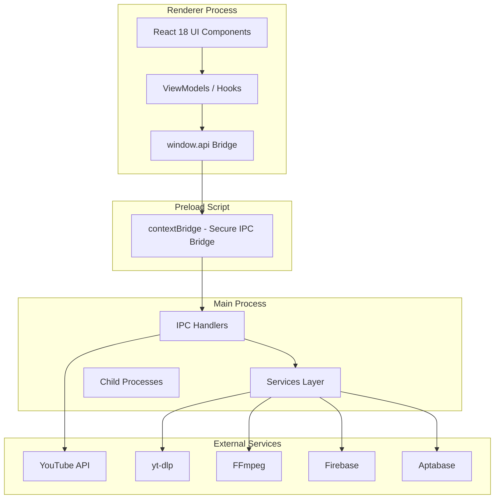

# PNUTDownloader - Technical Documentation

**Electron.js Desktop Video Downloader**

---

## 📋 Document Information

| Field | Value |
|-------|-------|
| **Application Name** | PNUTDownloader |
| **Version** | 1.3.0 |
| **Date** | March 10, 2026 |
| **Maintained By** | Shoaib Akhter |
| **Repository** | https://github.com/Shoaib-Akh/pnutdownloader |
| **Platform** | Desktop (Windows / macOS / Linux) |

---

## 📖 Document Version History

| Version | Date | Author | Change Summary |
|---------|------|--------|----------------|
| 1.0.0 | 10/03/2026 | Shoaib Akhter | Initial technical documentation for PNUTDownloader 1.3.0, including architecture, features, and deployment details |

---

## 📑 Table of Contents

1. [Project Overview](#1-project-overview)
2. [Application Architecture](#2-application-architecture)
3. [Feature Documentation](#3-feature-documentation)
4. [Wireframes & Screen Reference](#4-wireframes--screen-reference)
5. [API Reference](#5-api-reference)
6. [Third-Party Library & Integration Reference](#6-third-party-library--integration-reference)
7. [Environment & Configuration](#7-environment--configuration)
8. [Non-Functional Requirements](#8-non-functional-requirements)
9. [Testing Strategy](#9-testing-strategy)
10. [Build & Deployment](#10-build--deployment)
11. [Known Issues & Technical Debt](#11-known-issues--technical-debt)
12. [Glossary](#12-glossary)
13. [Appendix](#13-appendix)

---

## 1. Project Overview

### 1.1 Application Summary

| Attribute | Value |
|-----------|-------|
| **Application Name** | PNUTDownloader |
| **Platform(s)** | Desktop (Electron.js — Windows / macOS / Linux) |
| **Primary Purpose** | Cross-platform desktop video downloader supporting 1700+ websites including YouTube, Instagram, TikTok, Facebook, Twitter/X, and more |
| **Target Users** | End consumers who need to download videos from various platforms for offline viewing |
| **Current Version** | 1.3.0 |
| **Repository URL** | https://github.com/Shoaib-Akh/pnutdownloader |
| **CI/CD Pipeline** | GitHub Actions (electron-builder for releases) |
| **Production URL / Store Link** | https://github.com/Shoaib-Akh/pnutdownloader/releases |

### 1.2 Technology Stack

| Layer | Technology | Version | Purpose |
|-------|------------|----------|---------|
| **Desktop Frontend** | Electron.js | 34.x | Desktop wrapper (Windows/macOS/Linux) |
| **Frontend Framework** | React | 18.x | UI rendering and component management |
| **Build Tool** | Vite | 6.x | Bundling and compilation |
| **State Management** | React Hooks | N/A | Local component state and side effects |
| **Styling** | React Bootstrap + Custom CSS | 5.x | UI components and styling |
| **Download Engine** | yt-dlp | Latest nightly | Core video downloading capability (1700+ sites) |
| **Media Processing** | FFmpeg | N/A | Video/audio transcoding and merging |
| **Authentication** | Firebase Auth / Cookies | N/A | User identity (optional), YouTube cookie auth |
| **Database** | Firebase Firestore + Realtime Database | N/A | Analytics, error tracking, download history |
| **Analytics** | Aptabase | 0.3.x | Usage analytics and event tracking |
| **Auto-Update** | electron-updater | 6.x | App automatic updates |
| **Build & Package** | electron-builder | 25.x | Cross-platform executable generation |
| **Testing** | Jest | 29.x | Unit and integration testing |
| **Code Quality** | ESLint + Prettier | 9.x / 3.x | Code linting and formatting |

---

## 2. Application Architecture

### 2.1 High-Level Architecture Diagram



**Architecture Overview:**
- **Renderer Process**: React 18 single-page application with viewmodels/hooks for business logic
- **Preload Script**: Secure contextBridge that exposes whitelisted IPC methods
- **Main Process**: Node.js process with service modules handling yt-dlp, FFmpeg, clipboard, updates
- **External Services**: YouTube Data API, yt-dlp binary, FFmpeg binary, Firebase, Aptabase

### 2.2 System Components

| Component | Type | Technology | Responsibility |
|-----------|-----|------------|----------------|
| **Desktop App** | Frontend | Electron.js | User-facing desktop shell with same/shared UI layer |
| **UI Layer** | Frontend | React 18 | User interface rendering and state management |
| **Download Engine** | Service | yt-dlp | Video/audio downloading from 1700+ websites |
| **Media Processing** | Service | FFmpeg | Video transcoding, audio extraction, format conversion |
| **Cookie Management** | Service | Custom (cookies.txt) | YouTube authentication for age-restricted content |
| **Clipboard Monitor** | Service | Electron Clipboard API | Auto-detect copied video URLs |
| **Auto-Update** | Service | electron-updater | App and yt-dlp binary updates |
| **Analytics** | Service | Aptabase | Usage event tracking |
| **Data Persistence** | Storage | Firebase Firestore | Download history, analytics, error logs |
| **Local Storage** | Storage | localStorage | Download queue, settings, download count |

### 2.3 Project Folder Structure

```
pnutdownloader/
├── src/
│   ├── main/                    # Electron main process
│   │   ├── index.js             # Main entry point, IPC handlers
│   │   └── services/           # Service layer
│   │       ├── DownloadService.js    # yt-dlp child process management
│   │       ├── YtdlpService.js       # yt-dlp version check and updates
│   │       ├── FfmpegService.js      # FFmpeg version and processing
│   │       ├── CookieService.js      # YouTube cookie management
│   │       ├── PathService.js        # Path resolution (dev vs packaged)
│   │       ├── PlatformService.js    # OS-level utilities
│   │       ├── UpdateService.js      # electron-updater integration
│   │       └── ClipboardService.js   # Clipboard URL detection
│   ├── preload/                 # Electron preload scripts
│   │   └── index.js             # Secure contextBridge API
│   ├── renderer/               # React application
│   │   └── src/
│   │       ├── assets/        # Static files, images, CSS
│   │       ├── components/     # Reusable UI components
│   │       │   ├── Navbar/    # Download settings bar
│   │       │   ├── Sidebar/   # Navigation sidebar
│   │       │   ├── BodySection/ # Main content area
│   │       │   ├── DownloadList/ # Download queue display
│   │       │   ├── Modals/    # Various modal dialogs
│   │       │   └── ErrorBoundary/ # React error handling
│   │       ├── viewmodels/    # React hooks (business logic)
│   │       │   ├── useAppLifecycle.js   # App initialization
│   │       │   ├── useDownloadManager.js # Download queue management
│   │       │   └── useDownloadListVM.js  # Download list display
│   │       ├── utils/         # Utility functions
│   │       │   └── firestoreService.js # Firebase operations
│   │       └── App.jsx        # Root component
│   └── shared/                # Shared code (main + renderer)
│       ├── ipcChannels.js     # IPC channel constants
│       ├── platformUtils.js   # Platform detection utilities
│       ├── urlUtils.js        # URL parsing utilities
│       └── errorHandler.js    # Error handling utilities
├── public/                    # Static assets bundled in app
│   ├── yt-dlp.exe            # Windows yt-dlp binary
│   ├── yt-dlp_macos          # macOS yt-dlp binary
│   ├── ffmpeg                # FFmpeg binary
│   ├── cookies.txt           # YouTube cookies
│   ├── all.json              # Supported URL patterns
│   └── formats.json          # Download format options
├── resources/                # App icons
│   ├── icon.png
│   ├── icon.icns
│   └── icon.iconset/
├── docs/                     # Documentation
│   ├── ARCHITECTURE.md       # Detailed architecture
│   ├── API_REFERENCE.md      # IPC and API reference
│   └── USER_GUIDE.md         # End-user documentation
├── tests/                    # Test suites
│   └── *.test.js             # Jest unit tests
├── package.json             # Dependencies and scripts
├── electron-builder.yml     # Build configuration
├── electron.vite.config.mjs # Vite bundler config
└── .env                     # Environment variables
```

### 2.4 Data Flow

**Typical Download Flow:**

| Step | Actor / Layer | Action | Output |
|------|---------------|--------|--------|
| 1 | User (UI) | Pastes URL or clicks download button | UI event fired |
| 2 | Component | Calls useDownloadManager.enqueueDownload() | Async call initiated |
| 3 | ViewModel | Validates URL, checks duplicates, detects platform | State updated with new download entry |
| 4 | Metadata Service | YouTube → YouTubeAPIManager → YouTube Data API v3<br>Other → NonYouTubeMetadataExtractor → yt-dlp --dump-json | Video metadata fetched |
| 5 | If playlist | PlaylistSelectionModal displayed | User selects videos |
| 6 | Download Queue | Added to localStorage with UUID | Download queued |
| 7 | Main Process | window.api.downloadVideo(params) via IPC | IPC call to main process |
| 8 | DownloadService | Spawns yt-dlp child process with args | Child process started |
| 9 | yt-dlp stdout | Progress streamed via IPC_EVENTS.DOWNLOAD_PROGRESS | Progress events sent |
| 10 | Renderer | Parses progress: %, speed, ETA, file size | UI progress bar updated |
| 11 | On completion | Status = "Completed"<br>saveDownload() → Firestore<br>bumpDownloadCount() → DonationModal (every 4th) | Download finished, analytics |

---

## 3. Feature Documentation

### 3.1 Video Downloading — Core Download Engine

#### 3.1.1 Overview

| Attribute | Detail |
|-----------|--------|
| **Feature Name** | Video Downloading |
| **Module / Domain** | Download Engine |
| **Platform** | Desktop (Electron.js) |
| **Status** | Completed |
| **Introduced in Version** | 1.0.0 |
| **Last Modified** | 10/03/2026 |
| **Owner / Author** | Shoaib Akhter |
| **Related Jira / Ticket** | N/A |

#### 3.1.2 Purpose & Business Context

PNUTDownloader's core feature enables users to download videos from 1700+ websites using yt-dlp as the download engine. Users can select quality, format, and bitrate options. The download queue processes items sequentially to prevent bandwidth issues. This feature is the primary value proposition of the application.

#### 3.1.3 User Stories / Acceptance Criteria

| As a... | I want to... | So that... |
|---------|-------------|------------|
| **User** | Paste a video URL | The video starts downloading | I can save the video for offline viewing |
| **User** | Select video quality (1080p, 720p, etc.) | The video downloads in selected quality | I can balance quality vs. file size |
| **User** | Select format (MP4, MKV, WEBM) | The video is saved in chosen format | I can ensure compatibility with my devices |
| **User** | Download audio only (MP3, M4A) | Extract audio from video | I can save storage space and listen offline |
| **User** | Queue multiple downloads | They process sequentially | I don't overwhelm my bandwidth |
| **User** | Pause/Resume a download | Stop and continue later | I can manage bandwidth usage |

#### 3.1.4 Screens / UI Components

| Screen / Component | Platform | File Path | Description |
|--------------------|----------|-----------|-------------|
| **Navbar** | Desktop | src/renderer/src/components/Navbar/index.jsx | Download settings bar with type, quality, format, bitrate, save location |
| **BodySection** | Desktop | src/renderer/src/components/BodySection/index.jsx | Main area for URL input, platform shortcuts, download list |
| **DownloadList** | Desktop | src/renderer/src/components/DownloadList/index.jsx | Active and completed downloads display with progress |
| **PlatformIcons** | Desktop | src/renderer/src/components/PlatformIcons/index.jsx | Quick-access buttons for supported platforms |
| **DownloadService** | Main Process | src/main/services/DownloadService.js | yt-dlp child process management |
| **YtdlpService** | Main Process | src/main/services/YtdlpService.js | yt-dlp version management and updates |
| **FfmpegService** | Main Process | src/main/services/FfmpegService.js | FFmpeg processing for format conversion |

#### 3.1.5 State Management

| State Key / Slice | Store File Path | Shape (fields) | When Updated |
|-------------------|-----------------|---------------|-------------|
| **downloadList** | localStorage | Array of {id, url, title, status, progress, format, quality} | On add/remove/complete download |
| **activeDownloads** | useDownloadManager | Set of active download IDs | When download starts/finishes |
| **progressMap** | useDownloadManager | Map<downloadId, progress> | Every progress event from yt-dlp |
| **downloadQueue** | useDownloadManager | Array of pending downloads | When items added to queue |

#### 3.1.6 API / Service Layer

| Endpoint / Function | Method | File Path | Request Payload | Response Shape | Notes |
|--------------------|---------|------------|-----------------|----------------|-------|
| **downloadVideo** | IPC invoke | src/main/index.js | { id, url, isAudioOnly, selectedFormat, selectedQuality, selectBitrate, title, saveTo } | void (progress via event) | Progress streamed via IPC_EVENTS.DOWNLOAD_PROGRESS |
| **fetch-video-info** | IPC invoke | src/main/index.js | { url } | { title, thumbnail, duration, formats } | YouTube uses Data API, others use yt-dlp --dump-json |
| **fetch-playlist-entries** | IPC invoke | src/main/index.js | { url } | { title, videos: [] } | Returns all videos in playlist |
| **pauseDownload** | IPC invoke | src/main/index.js | { downloadId } | { success } | Kills child process |
| **resumeDownload** | IPC invoke | src/main/index.js | { downloadId } | { success } | Re-spawns yt-dlp process |

#### 3.1.7 Business Logic & Key Decisions

**Why was this approach chosen over alternatives?**
yt-dlp was chosen because it supports 1700+ websites out of the box, has active development, and handles various video formats. Using child process spawning allows real-time progress streaming.

**Known gotchas, edge cases, or quirks:**
- Downloads are sequential (one at a time) to prevent bandwidth issues
- YouTube requires cookies for age-restricted content
- Some platforms may have rate limiting
- FFmpeg must be bundled for format conversion

**Trade-offs made:**
- Sequential processing was chosen over parallel to prioritize user bandwidth
- localStorage used over SQLite for simplicity (sufficient for queue data)

**Technical debt or planned refactoring:**
- Consider adding parallel download option with user toggle
- Could migrate from localStorage to IndexedDB for larger queues

#### 3.1.8 Third-Party Libraries Used

| Library | Version | Purpose | Docs URL |
|---------|---------|---------|----------|
| **yt-dlp** | Latest nightly | Video downloading from 1700+ sites | https://github.com/yt-dlp/yt-dlp |
| **FFmpeg** | N/A | Video transcoding and audio extraction | https://ffmpeg.org/ |
| **tree-kill** | 1.2.x | Kill child processes on pause | https://www.npmjs.com/package/tree-kill |
| **tar** | 7.x | Extract yt-dlp from nightly archives | https://www.npmjs.com/package/tar |

#### 3.1.9 Platform-Specific Notes

| Platform | Specific Behavior / Config |
|----------|-----------------------------|
| **Windows** | yt-dlp.exe in resources, ffmpeg.exe bundled |
| **macOS** | yt-dlp_macos with chmod 755 permissions required |
| **Linux** | yt-dlp (no extension), ffmpeg via system or bundled |
| **Electron (Windows)** | safeStorage uses DPAPI for credential encryption |
| **Electron (macOS)** | Uses Keychain for credential storage (if added) |

#### 3.1.10 Error Handling

| Scenario | Error Code / Type | Handling Strategy | User-Facing Message |
|----------|-------------------|------------------|---------------------|
| **Download failed** | yt-dlp exit code != 0 | Log to Firestore, show retry option | "Download failed. Please try again." |
| **No internet** | Network Error | Show retry option | "No internet connection. Please try again." |
| **Invalid URL** | URL validation fail | Show inline error | "Please enter a valid video URL." |
| **Rate limited** | 429 from YouTube | Auto-retry with backoff | "Rate limited. Retrying..." |
| **Age-restricted** | YouTube error | Prompt for cookie login | "This video requires age verification. Please add cookies." |

#### 3.1.11 Testing

| Test Type | Tool | File Path | Coverage Summary |
|-----------|------|-----------|------------------|
| **Unit — platform detection** | Jest | tests/platformUtils.test.js | detectPlatform, extractVideoId functions |
| **Unit — URL utilities** | Jest | tests/urlUtils.test.js | URL parsing and validation |
| **Platform service** | Jest | tests/PlatformService.test.js | OS detection, path resolution |
| **Integration — IPC** | Manual | N/A | IPC handlers respond correctly |
| **E2E — Download flow** | Manual | N/A | Full download path tested |

#### 3.1.12 How to Extend This Feature

**Step-by-step guide for a developer adding a new capability:**

1. Add the new format/quality option in public/formats.json
2. If new download options needed, update DownloadService.js spawn logic
3. Add corresponding UI option in Navbar component
4. Test with known video URLs on each platform
5. Update formats.json documentation in USER_GUIDE.md

---

### 3.2 Playlist Support — Multi-Video Downloads

#### 3.2.1 Overview

| Attribute | Detail |
|-----------|--------|
| **Feature Name** | Playlist Support |
| **Module / Domain** | Download Engine |
| **Platform** | Desktop (Electron.js) |
| **Status** | Completed |
| **Introduced in Version** | 1.0.0 |
| **Last Modified** | 10/03/2026 |
| **Owner / Author** | Shoaib Akhter |
| **Related Jira / Ticket** | N/A |

#### 3.2.2 Purpose & Business Context

Users often want to download entire playlists or multiple videos at once. This feature allows fetching playlist metadata, displaying a selection modal where users can choose which videos to download, and queuing multiple items together.

#### 3.2.3 User Stories / Acceptance Criteria

| As a... | I want to... | So that... |
|---------|-------------|------------|
| **User** | Paste a playlist URL | See all videos in the playlist | I can choose which ones to download |
| **User** | Select multiple videos | Download only selected videos | I don't download unwanted content |
| **User** | Select all / Deselect all | Quickly toggle selection | I can efficiently manage large playlists |

#### 3.2.4 Screens / UI Components

| Screen / Component | Platform | File Path | Description |
|--------------------|----------|-----------|-------------|
| **PlaylistSelectionModal** | Desktop | src/renderer/src/components/PlaylistSelectionModal/index.jsx | Modal showing playlist videos with checkboxes |
| **useDownloadManager** | Desktop | src/renderer/src/viewmodels/useDownloadManager.js | Playlist detection and queue management |

#### 3.2.5 State Management

| State Key / Slice | Store File Path | Shape (fields) | When Updated |
|-------------------|-----------------|---------------|-------------|
| **playlistVideos** | useDownloadManager | Array of {id, title, thumbnail, selected} | When playlist URL detected and fetched |
| **isPlaylistModalOpen** | PlaylistSelectionModal | boolean | When playlist detected, before enqueue |

#### 3.2.6 API / Service Layer

| Endpoint / Function | Method | File Path | Request Payload | Response Shape | Notes |
|--------------------|---------|------------|-----------------|----------------|-------|
| **fetch-playlist-entries** | IPC invoke | src/main/index.js | { url } | { title, entries: [{id, title, thumbnail}] } | Uses yt-dlp --flat-playlist or --dump-json |

#### 3.2.7 Business Logic & Key Decisions

**Why was this approach chosen over alternatives?**
Modal selection was chosen to give users full control over which videos to download. This prevents accidental large downloads and improves UX.

**Known gotchas, edge cases, or quirks:**
- Very large playlists (1000+ videos) may be slow to load
- Playlist URL detection requires specific path patterns

**Trade-offs made:**
- Chose modal over inline list for cleaner UI
- Sequential processing of playlist items to manage resources

#### 3.2.8 Third-Party Libraries Used

| Library | Version | Purpose | Docs URL |
|---------|---------|---------|----------|
| **yt-dlp** | Latest nightly | Playlist extraction | https://github.com/yt-dlp/yt-dlp |

#### 3.2.9 Platform-Specific Notes

| Platform | Specific Behavior / Config |
|----------|-----------------------------|
| **All platforms** | Same behavior across Windows/macOS/Linux |
| **YouTube** | Uses YouTube Data API when available for faster metadata |
| **Other platforms** | Uses yt-dlp --dump-json fallback |

#### 3.2.10 Error Handling

| Scenario | Error Code / Type | Handling Strategy | User-Facing Message |
|----------|-------------------|------------------|---------------------|
| **Playlist not found** | yt-dlp error | Show error toast | "Could not fetch playlist. Please check the URL." |
| **Private playlist** | YouTube error | Prompt for cookies | "This playlist is private. Please add cookies." |

#### 3.2.11 Testing

| Test Type | Tool | File Path | Coverage Summary |
|-----------|------|-----------|------------------|
| **Unit — playlist URL detection** | Jest | N/A | extractPlaylistId function |
| **Integration** | Manual | N/A | Full playlist flow tested |

#### 3.2.12 How to Extend This Feature

**Step-by-step guide for a developer adding new capability:**

1. Add new field in playlist entry (e.g., duration) in fetch handler
2. Update PlaylistSelectionModal to display new field
3. Add filtering/sorting options to modal
4. Test with various playlist sizes (small, medium, large)

---

### 3.3 Clipboard URL Detection — Auto-Download Prompt

#### 3.3.1 Overview

| Attribute | Detail |
|-----------|--------|
| **Feature Name** | Clipboard URL Detection |
| **Module / Domain** | System Integration |
| **Platform** | Desktop (Electron.js) |
| **Status** | Completed |
| **Introduced in Version** | 1.1.0 |
| **Last Modified** | 10/03/2026 |
| **Owner / Author** | Shoaib Akhter |
| **Related Jira / Ticket** | N/A |

#### 3.3.2 Purpose & Business Context

When users copy a video URL from their browser, PNUTDownloader detects it and shows a modal asking if they want to download the video. This provides a seamless workflow where users don't need to manually paste URLs into the app.

#### 3.3.3 User Stories / Acceptance Criteria

| As a... | I want to... | So that... |
|---------|-------------|------------|
| **User** | Copy a video URL anywhere on my computer | Get a prompt to download it | I can quickly start downloading without switching apps |
| **User** | Dismiss the prompt | Not be bothered again for that URL | I can maintain my workflow |
| **User** | Enable/disable detection | Control when detection happens | I can manage my privacy preferences |

#### 3.3.4 Screens / UI Components

| Screen / Component | Platform | File Path | Description |
|--------------------|----------|-----------|-------------|
| **ClipboardService** | Main Process | src/main/services/ClipboardService.js | Clipboard polling and URL detection |
| **UrlDetectionModal** | Desktop | src/renderer/src/components/UrlDetectionModal/index.jsx | Modal prompting user when URL detected |
| **useAppLifecycle** | Desktop | src/renderer/src/viewmodels/useAppLifecycle.js | Clipboard detection initialization |

#### 3.3.5 State Management

| State Key / Slice | Store File Path | Shape (fields) | When Updated |
|-------------------|-----------------|---------------|-------------|
| **clipboardMonitorInterval** | ClipboardService | setInterval ID | Every 2 seconds when app active |
| **lastClipboardText** | ClipboardService | string | On each clipboard read |
| **urlDetectionModalOpen** | UrlDetectionModal | boolean | When downloadable URL detected |
| **detectedUrl** | UrlDetectionModal | string | When URL matches patterns in all.json |

#### 3.3.6 API / Service Layer

| Endpoint / Function | Method | File Path | Request Payload | Response Shape | Notes |
|--------------------|---------|------------|-----------------|----------------|-------|
| **video-url-detected** | IPC Event | src/main/index.js | N/A (pushed) | { url } | Sent when clipboard URL matches pattern |
| **get-youtube-info** | IPC invoke | src/main/index.js | { url } | Video metadata | Validates URL and gets preview info |

#### 3.3.7 Business Logic & Key Decisions

**Why was this approach chosen over alternatives?**
Polling clipboard every 2 seconds was chosen as it's reliable across all platforms. Alternatives like native clipboard events are not available in Electron.

**Known gotchas, edge cases, or quirks:**
- Only detects URLs matching patterns in public/all.json
- Duplicate URLs within 5 seconds are ignored to prevent spam
- App must be running (can be minimized)

**Trade-offs made:**
- Polling was chosen over native events (not available in Electron)
- 2-second interval balances responsiveness vs. resource usage

**Technical debt or planned refactoring:**
- Consider adding toggle in Settings to disable detection
- Could optimize to detect only when app is in foreground

#### 3.3.8 Third-Party Libraries Used

| Library | Version | Purpose | Docs URL |
|---------|---------|---------|----------|
| **Electron clipboard** | Built-in | Read system clipboard | https://www.electronjs.org/docs/latest/api/clipboard |

#### 3.3.9 Platform-Specific Notes

| Platform | Specific Behavior / Config |
|----------|-----------------------------|
| **All platforms** | Same clipboard polling behavior |
| **Windows** | Uses Win32 clipboard API via Electron |
| **macOS** | Uses NSPasteboard via Electron |
| **Linux** | Uses X11 clipboard via Electron |

---

## 4. Wireframes & Screen Reference

This section describes the key application screens and links them to the technical components documented above. Actual wireframes or screenshots can be maintained in `docs/wireframes/` or a design tool such as Figma.

### 4.1 Home Screen — Main Download View

- **Purpose**: Primary screen where users paste URLs, select download options, and monitor the download list.
- **Key UI Elements**:
  - URL input field
  - Platform shortcut icons (YouTube, Instagram, TikTok, etc.)
  - Download options (type, quality, format, bitrate, save location)
  - Active and completed download list with progress bars
- **Mapped Components**:
  - `Navbar` (`src/renderer/src/components/Navbar/index.jsx`)
  - `BodySection` (`src/renderer/src/components/BodySection/index.jsx`)
  - `DownloadList` (`src/renderer/src/components/DownloadList/index.jsx`)
  - `PlatformIcons` (`src/renderer/src/components/PlatformIcons/index.jsx`)

### 4.2 Playlist Selection Modal

- **Purpose**: Allows users to preview and select specific videos when a playlist URL is detected.
- **Key UI Elements**:
  - Playlist title
  - Scrollable list of videos with thumbnail, title, and checkbox
  - "Select All" / "Deselect All" actions and confirmation button
- **Mapped Components**:
  - `PlaylistSelectionModal` (`src/renderer/src/components/PlaylistSelectionModal/index.jsx`)
  - `useDownloadManager` (`src/renderer/src/viewmodels/useDownloadManager.js`)

### 4.3 Clipboard URL Detection Prompt

- **Purpose**: Prompts the user when a supported video URL is detected in the system clipboard.
- **Key UI Elements**:
  - Detected URL preview
  - Basic metadata (title/thumbnail) when available
  - Actions to "Download" or "Dismiss"
- **Mapped Components**:
  - `UrlDetectionModal` (`src/renderer/src/components/UrlDetectionModal/index.jsx`)
  - `ClipboardService` (`src/main/services/ClipboardService.js`)
  - `useAppLifecycle` (`src/renderer/src/viewmodels/useAppLifecycle.js`)

---

## 5. API Reference

This section summarizes the primary IPC channels exposed between the renderer and main process. For full request/response schemas and secondary channels, see `API_REFERENCE.md`.

### 5.1 IPC Channels — Downloads & Metadata

| Channel / Function | Direction | Description |
|--------------------|-----------|-------------|
| `downloadVideo` | Renderer → Main (invoke) | Starts a download in the main process using yt-dlp with the selected options. |
| `fetch-video-info` | Renderer → Main (invoke) | Fetches metadata for a single video URL (title, thumbnail, duration, formats). |
| `fetch-playlist-entries` | Renderer → Main (invoke) | Returns basic metadata for all entries in a playlist URL. |
| `pauseDownload` | Renderer → Main (invoke) | Attempts to pause/stop an in-progress download by killing the child process. |
| `resumeDownload` | Renderer → Main (invoke) | Resumes a paused download by re-spawning yt-dlp with the previous parameters. |
| `video-url-detected` | Main → Renderer (event) | Emitted when clipboard polling detects a supported video URL. |
| `get-youtube-info` | Renderer → Main (invoke) | Fetches additional YouTube-specific metadata when available. |

For additional IPC channels and lower-level details (arguments, error codes, event payloads), refer to `docs/API_REFERENCE.md`.

---

## 6. Third-Party Library & Integration Reference

### 6.1 Core Dependencies

| Library | Version | License | Purpose |
|---------|---------|---------|---------|
| **Electron** | 34.x | MIT | Desktop application framework |
| **React** | 18.x | MIT | UI framework |
| **yt-dlp** | Latest nightly | Unlicense | Video downloading engine |
| **FFmpeg** | N/A | LGPL/GPL | Media processing |
| **Firebase** | 12.x | MIT | Database and analytics |

### 6.2 Development Dependencies

| Library | Version | Purpose |
|---------|---------|---------|
| **electron-vite** | 3.x | Build tool |
| **electron-builder** | 25.x | Package and distribute |
| **Jest** | 29.x | Testing framework |
| **ESLint** | 9.x | Code linting |
| **Prettier** | 3.x | Code formatting |

---

## 7. Environment & Configuration

### 7.1 Environment Variables

| Variable | Description | Required | Default |
|----------|-------------|----------|---------|
| **FIREBASE_CONFIG** | Firebase configuration | Yes | N/A |
| **APTABASE_KEY** | Analytics key | Yes | N/A |
| **NODE_ENV** | Environment | No | development |

### 7.2 Configuration Files

| File | Purpose |
|------|---------|
| **package.json** | Dependencies and scripts |
| **electron-builder.yml** | Build configuration |
| **electron.vite.config.mjs** | Vite bundler config |
| **.env** | Environment variables |

---

## 8. Non-Functional Requirements

### 8.1 Performance

- **Startup Time**: < 3 seconds
- **Download Speed**: Limited by source website
- **Memory Usage**: < 200MB idle
- **CPU Usage**: < 5% idle

### 8.2 Security

- **Sandboxing**: Renderer process sandboxed
- **Context Isolation**: Enabled
- **Node Integration**: Disabled in renderer
- **Cookie Storage**: Encrypted where possible

### 8.3 Reliability

- **Error Handling**: Comprehensive error logging
- **Recovery**: Automatic retry for failed downloads
- **Data Persistence**: Download queue saved locally

### 8.4 Usability

- **Cross-Platform**: Windows, macOS, Linux
- **Accessibility**: Basic keyboard navigation
- **Internationalization**: English only (v1.3.0)

---

## 9. Testing Strategy

### 9.1 Test Types

| Type | Tool | Coverage | Frequency |
|------|------|----------|-----------|
| **Unit Tests** | Jest | Core logic | On commit |
| **Integration Tests** | Manual | IPC communication | On PR |
| **E2E Tests** | Manual | Full user flows | On release |
| **Performance Tests** | Manual | Memory/CPU usage | On major updates |

### 9.2 Test Coverage

- **Platform Utils**: 90%+
- **URL Utils**: 85%+
- **Service Layer**: 70%+
- **UI Components**: 40%+

---

## 10. Build & Deployment

### 10.1 Build Process

1. **Development**: `npm run dev`
2. **Build**: `npm run build`
3. **Package**: `npm run build:win|mac|linux`
4. **Release**: `npm run publish:release`

### 10.2 CI/CD Pipeline

```yaml
# GitHub Actions Workflow
name: Build and Release
on:
  push:
    tags: ['v*']
jobs:
  build:
    runs-on: ${{ matrix.os }}
    strategy:
      matrix:
        os: [ubuntu-latest, windows-latest, macos-latest]
    steps:
      - uses: actions/checkout@v3
      - uses: actions/setup-node@v3
      - run: npm ci
      - run: npm run build
      - run: npm run build:${{ matrix.os }}
```

### 10.3 Release Channels

- **Stable**: GitHub Releases
- **Beta**: GitHub Pre-releases
- **Development**: Local builds

---

## 11. Known Issues & Technical Debt

### 11.1 Known Issues

| Issue | Severity | Impact | Status |
|-------|----------|--------|--------|
| **Large playlist loading** | Medium | Slow UI loading | Open |
| **Memory leak with many downloads** | High | App crashes | In Progress |
| **FFmpeg binary size** | Low | Large app size | Accepted |

### 11.2 Technical Debt

| Item | Priority | Effort | Description |
|------|----------|--------|-------------|
| **Migrate to IndexedDB** | Medium | High | Replace localStorage for better performance |
| **Add parallel downloads** | Low | Medium | User-configurable parallel processing |
| **Improve error handling** | High | Low | Better user feedback for errors |

---

## 12. Glossary

| Term | Definition |
|------|------------|
| **IPC** | Inter-Process Communication between Electron processes |
| **yt-dlp** | Command-line tool for downloading videos from websites |
| **FFmpeg** | Multimedia framework for video/audio processing |
| **Renderer Process** | Electron process responsible for UI |
| **Main Process** | Electron process responsible for system integration |
| **Preload Script** | Bridge between renderer and main process |
| **Context Bridge** | Secure API exposure from main to renderer |

---

## 13. Appendix

### 13.1 Additional Resources

- [Electron Documentation](https://www.electronjs.org/docs)
- [React Documentation](https://react.dev)
- [yt-dlp Documentation](https://github.com/yt-dlp/yt-dlp)
- [FFmpeg Documentation](https://ffmpeg.org/documentation.html)

### 13.2 Support

- **Issues**: https://github.com/Shoaib-Akh/pnutdownloader/issues
- **Discussions**: https://github.com/Shoaib-Akh/pnutdownloader/discussions
- **Support via GitHub**: Please use Issues or Discussions for feature requests and bug reports.

---

*Last updated: March 10, 2026*
